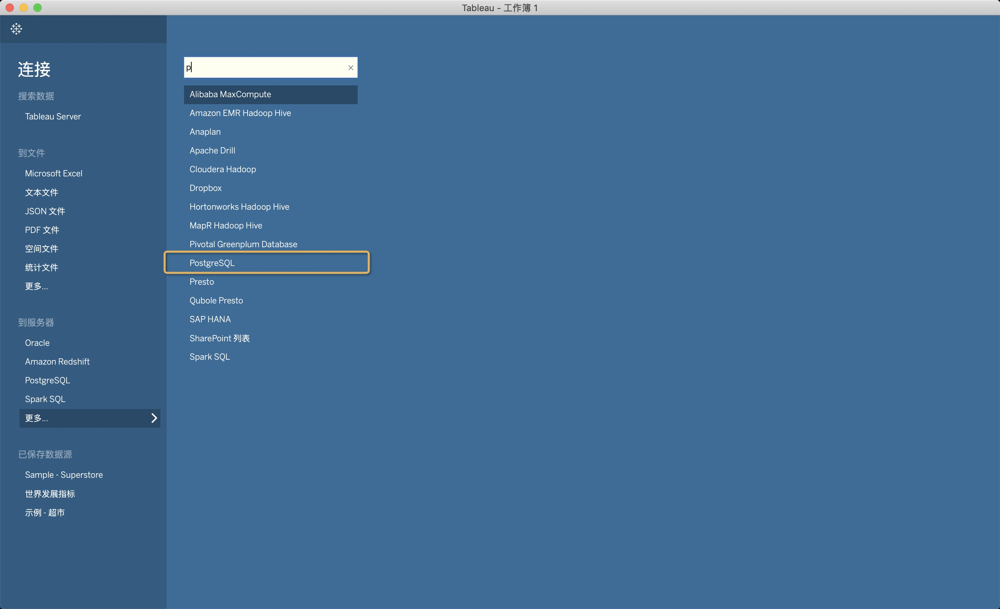
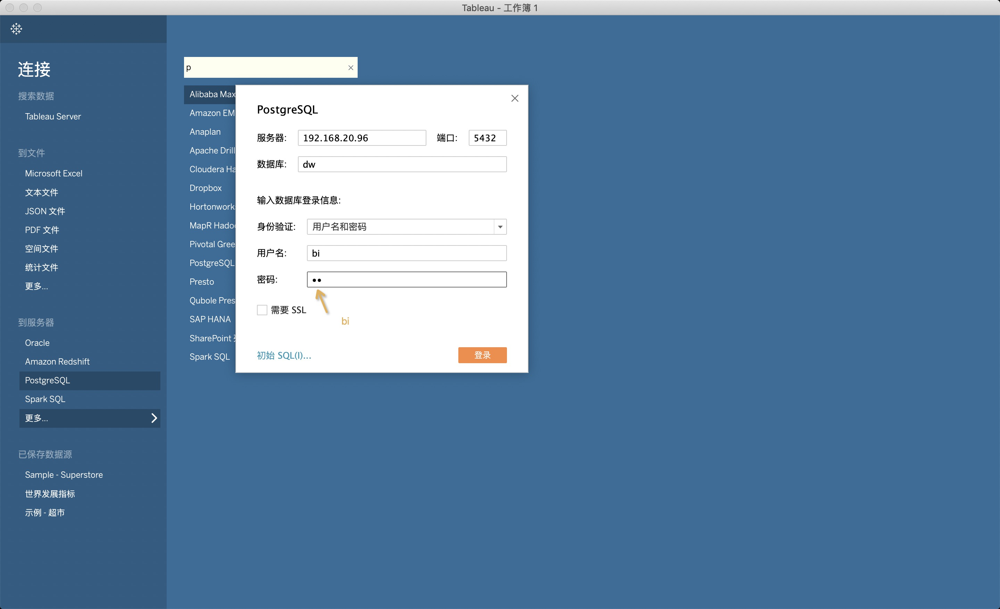
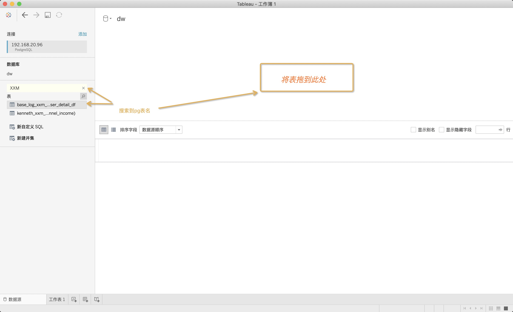
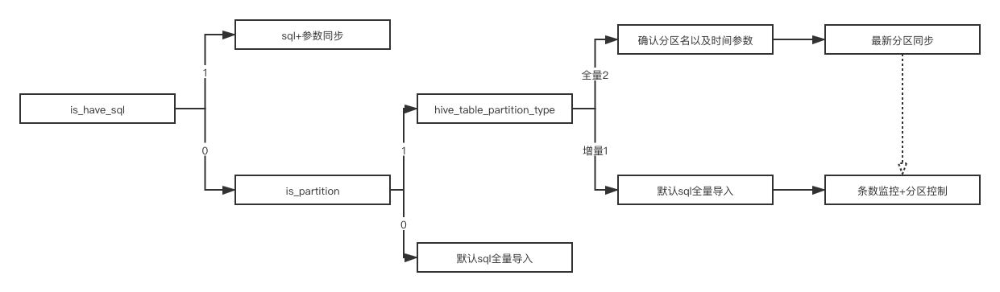

---
<!-- TOC -->
- [hive2pgsql](#hive2pgsql)
  - [1.pg链接tableau以及同步任务配置](#1pg链接tableau以及同步任务配置)
  - [2.添加数据源步骤](#2添加数据源步骤)
  - [3.同步需要信息](#3同步需要信息)
  - [4.大致流程与逻辑](#4大致流程与逻辑)
  - [备注](#备注)
<!-- /TOC -->

---

## hive2pgsql
- 描述与目的
1. 解决tableau直连spark 接口不稳定造成看板刷新时间不定的问题。
2. 解决tableau与数仓之间没有血缘关系，造成数仓底表未刷新定时跑tableau看板数据未刷新问题。
3. 解决tableau目前依赖任务较多无法管理问题。

- 如何运行
1. 目前进程在每日6点开始以10分钟的心跳轮训访问当日配置表。直至当日任务完成或轮训40次。

- 监控地址
1. [pg监控地址](http://192.168.20.96:3000/d/_CbwDmMGz/pg_sql_database?orgId=1 "wow").
2. [流程监控地址](http://192.168.20.96:3000/d/PYY86LiGz/hive2pgsql?orgId=1 'wow').


#### 1.pg链接tableau以及同步任务配置

>由于目前大部分链接至tableau都是spark，为了缓解sparkthrift压力，使用pgsql作为第二个看板数据源。
<br/>

#### 2.添加数据源步骤
<br/>

1. 找到pg数据源



<br/>

2. 填写数据库信息


<br/>

3. 搜索表名


<br/>

#### 3.同步需要信息
~~http://shimo.ximalaya.com/sheets/9PqhCVpTrq3QhG9k/MODOC/ 《hive2pg配置文件》~~
<br/>
只需表名，调度名，工作簿名称。

#### 4.大致流程与逻辑
这些我这边会配置好
目前分为两种同步方式
1. 表同步

2. sql同步

两种同步方式通过is_hive_sql来区分，<br/>
当is_hive_sql填true的时候需要附件sql,将会通过sql生成pg表。<br/>

整体生成sql逻辑为<br/>



3. 配置表表名

```sql
-- 血缘表
load jdbc.`pg1.public.dw_hive2pg_etl_relation_config`  (id,target_proc_db,target_proc,source_proc_ip,source_proc_db,source_proc,insert_date,remark,is_valid)  limit 10  as t;
select id,target_proc_db,target_proc,source_proc_ip,source_proc_db,source_proc,insert_date,remark,is_valid from t;
-- 日志表
load jdbc.`pg1.public.dw_hive2pg_log_detail`  (id,start_time,end_time,pg_table_name,result,ip,db,heartbeat_time)  limit 10  as t;
select id,start_time,end_time,pg_table_name,result,ip,db,heartbeat_time from t;
-- 配置表
load jdbc.`pg1.public.dw_hive2pg_table_name_config`  (id,hive_table_name,is_partition,pg_table_name,db,ip,is_have_sql,is_valid,heartbeat_time,desc_owner,retry_times,hive_table_partition_type,partition_name,partition_format)  limit 10  as t;
select id,hive_table_name,is_partition,pg_table_name,db,ip,is_have_sql,is_valid,heartbeat_time,desc_owner,retry_times,hive_table_partition_type,partition_name,partition_format from t

```


#### 备注
hive表字段名存在（大写，数字开头）
<br/>
等上述情况只能使用sql同步的方式
